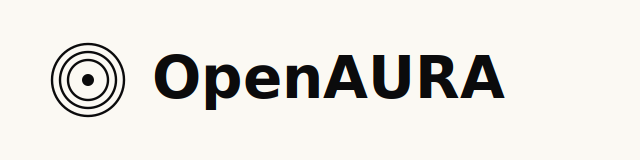
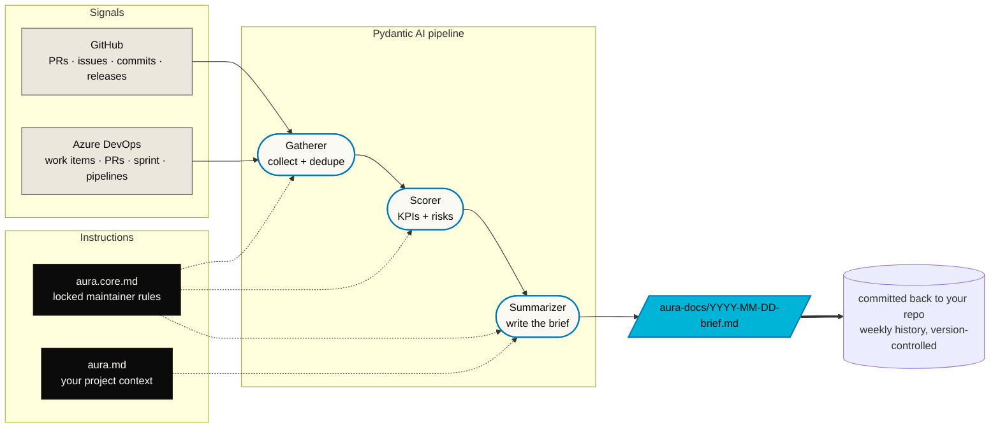

<!-- markdownlint-disable MD033 MD041 -->
<div align="center">

<p>
  
</p>

<p><strong>Agentic Updates, Reviews, and Accountability.</strong></p>

<p><em>A simple agentic method for turning project activity into a weekly Scrum-ready brief.</em></p>

<p>

<a href="./LICENSE"></a>
<a href="https://pypi.org/project/open-aura/"></a>


<a href="https://github.com/pradelgorithm/openaura/actions/workflows/ci.yml"></a>
<a href="https://github.com/pradelgorithm/openaura/actions/workflows/codeql.yml"></a>
<a href="https://securityscorecards.dev/viewer/?uri=github.com/pradelgorithm/openaura"></a>
<a href="https://codecov.io/gh/pradelgorithm/openaura"></a>
<a href="https://docs.astral.sh/ruff/"></a>
<a href="http://mypy-lang.org/"></a>
<a href="https://coderabbit.ai"></a>
<a href="./SECURITY.md"></a>

</p>

<p>
<a href="https://openaura.org/">Website</a> ·
<code>pip install open-aura</code>
</p>

<br>

<p><strong>Your weekly project brief, generated from real work.</strong></p>

</div>

---

AURA connects the signals your team already produces — code changes, pull requests,
issues, sprint activity, and KPIs — and turns them into a structured weekly review
every Friday or Monday morning.

Built for product managers, technical project managers, engineering managers, and
Scrum teams who want a lightweight, evidence-based way to stay aligned without manual
reporting.

> **Turn delivery signals into a living weekly brief.**

---

## Why AURA exists

Agentic projects move too fast to track by hand. Teams already produce the raw material
for good project reporting — but most weekly status updates are still manual,
inconsistent, and disconnected from the actual work.

AURA exists to make weekly project communication:

- **lightweight**
- **repeatable**
- **evidence-based**
- **easy to review**
- **grounded in delivery reality**

It helps replace status theater with real operating visibility.

## What AURA is

AURA is a simple agentic documentation method for project and product work.

It is **not** a heavyweight framework. **Not** another dashboard. **Not** static
documentation that goes stale after two weeks.

AURA is a recurring agent-generated brief that helps teams answer the same core
questions every sprint:

- What changed?
- What shipped?
- What is off track?
- What do the metrics say?
- What needs attention next?

## How it works



### 1. Connect your project signals

AURA pulls from the systems where work actually happens:

- code repositories
- pull requests
- issues and tickets
- sprint boards
- release notes
- operational metrics
- product KPIs
- custom team signals

### 2. Define shared and custom KPIs

Every project can use a common baseline plus project-specific measures.

**Shared KPIs** — delivery throughput, cycle time, lead time, bug count, blocker count,
release frequency, sprint completion rate, incident count.

**Custom KPIs** — onboarding completion rate, conversion lift, adoption by feature,
response latency, appointment booking rate, model quality thresholds, customer outcome
metrics, or anything else you declare in `aura.md`.

### 3. Run the agent on a schedule

AURA is triggered on a recurring cadence from your CI:

- **Friday afternoon** for sprint wrap-up
- **Monday morning** for planning and alignment
- **On every merged PR** for continuous, rolling updates

A Pydantic AI orchestrator drives three subagents (gatherer, scorer, summarizer) that
collect evidence, evaluate KPIs, and produce a structured brief.

### 4. Publish the weekly brief

Every run writes a single markdown file to `aura-docs/YYYY-MM-DD-{project}-brief.md`
in your repo. The file is committed by the CI step — your repo becomes a living
weekly history of the project.

No Slack integration. No email. No dashboard. Just markdown in version control, where
it belongs.

## What goes into an AURA brief

Every brief follows the same structure.

| Section | What it contains |
|---|---|
| **Executive summary** | A short summary of what changed this week and what matters most. |
| **Sprint activity** | Concise overview of merged work, completed tickets, releases, and meaningful project movement. |
| **KPI scorecard** | Snapshot of shared and custom KPIs, with trends and notable changes. |
| **Findings** | Agent-generated observations based on the evidence collected across systems. |
| **Risks and blockers** | Items slowing progress, creating uncertainty, or requiring escalation — each with evidence links. |
| **Decisions needed** | Decisions, approvals, or tradeoffs that need owner attention. |
| **Next focus** | Recommended priorities for the next sprint or week. |
| **Evidence** | Links back to the underlying pull requests, issues, commits, tickets, and metrics. |

## Design principles

- **Simple by default.** AURA should be easy to run, easy to read, easy to maintain.
- **Evidence first.** Every summary traces to actual delivery signals. Every claim links to a source.
- **Shared plus custom.** Common baseline for every project, plus metrics that matter to your team.
- **Recurring, not one-time.** AURA runs every week and builds a living history.
- **Agentic, not fully automatic.** The agent gathers, scores, summarizes, and suggests. Humans still decide.
- **No status theater.** If the week was quiet, the brief says so. If it was on fire, the brief says so.

## Who AURA is for

Teams that need better weekly visibility without building a heavy reporting process:

- product managers
- technical project managers
- engineering managers
- founders and delivery leads
- Scrum teams
- platform teams
- cross-functional program owners

Especially useful for **agentic and AI product teams** where the pace of change
outruns manual reporting.

## Quick start

### 1. Install

OpenAURA supports Python 3.11 and newer. The CI matrix currently verifies Python
3.11, 3.12, 3.13, and 3.14.

```bash
pip install open-aura
```

### 2. Configure

Create `aura.config.yml` at the root of your repo:

```yaml
project: "my-project"
trigger: weekly           # or on-merge / both
model: "anthropic:claude-sonnet-4-6"
# model: "openai:gpt-5.2"
signals:
  github:
    repo: "your-org/your-repo"
output:
  folder: "aura-docs"     # where briefs land (default)
```

Optionally, add `aura.md` with your project context (sprint goal, team, KPI targets,
custom rules). Copy the starter:

```bash
python -c "from importlib.resources import files; import shutil; shutil.copy(files('openaura.instructions') / 'aura.md.example', 'aura.md')"
```

### 3. Add the CI workflow

```bash
mkdir -p .github/workflows
python -c "from importlib.resources import files; import shutil; shutil.copy(files('openaura.templates') / 'github-actions.yml', '.github/workflows/aura.yml')"
```

### 4. Add the model provider API key

In your repo's **Settings → Secrets and variables → Actions**, add:

- `ANTHROPIC_API_KEY` when `model` starts with `anthropic:`
- `OPENAI_API_KEY` when `model` starts with `openai:`

`GITHUB_TOKEN` is provided automatically by Actions.

### 5. Commit and push

```bash
git add aura.config.yml aura.md .github/workflows/aura.yml
git commit -m "chore: add AURA weekly briefs"
git push
```

Next Friday at 17:00 UTC, your first brief lands in `aura-docs/`.

## CLI

| Command | What it does |
|---|---|
| `aura run` | Full pipeline: gather → score → summarize → write markdown |
| `aura run --dry-run` | Same, but prints the JSON brief instead of writing to disk |
| `aura validate` | Check config + env vars; no API or LLM calls |
| `aura manifesto` | Print the bundled AURA Protocol manifesto |

## Contributing

Contributions welcome — please read [`CONTRIBUTING.md`](CONTRIBUTING.md) first.

```bash
git clone https://github.com/pradelgorithm/openaura.git
cd openaura
python -m venv .venv && source .venv/bin/activate
python -m pip install --upgrade pip
python -m pip install -e ".[dev]"
python -m pytest
```

## Documentation

- [`openaura/instructions/aura.core.md`](openaura/instructions/aura.core.md) — locked
  agent system prompt. Read this before contributing.
- [`openaura/instructions/aura.md.example`](openaura/instructions/aura.md.example) —
  user-editable project context template.
- [`MANIFESTO.md`](MANIFESTO.md) — the AURA Protocol: 10 rules for accurate repo updates.
- [`AGENTS.md`](AGENTS.md) — coding-agent setup, checks, security, and human-review rules.
- [`CONTRIBUTING.md`](CONTRIBUTING.md) — developer setup and PR expectations.
- [`SECURITY.md`](SECURITY.md) — vulnerability disclosure policy.
- [`CODE_OF_CONDUCT.md`](CODE_OF_CONDUCT.md) — community standards.
- [`brandbook/`](brandbook/) — visual identity.

## License

Apache 2.0 — see [`LICENSE`](LICENSE).

---

<div align="center">
<sub>Built with <a href="https://ai.pydantic.dev">Pydantic AI</a>.
Reviewed by <a href="https://coderabbit.ai">CodeRabbit</a>.
Scored by <a href="https://securityscorecards.dev">OpenSSF Scorecard</a>.</sub>
</div>
